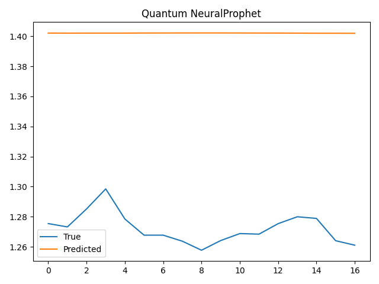

# ThermoTwinAI-Quantum

This project uses quantum-classical forecasting models to analyze degradation in TFTECs.

## Prototype Evolution
Initial experiments relied on univariate signals. The latest prototype incorporates multi-sensor inputs and hyperparameter tuning, yielding the following changes:

| Model                     | Metric  | Before (Univariate) | After (Multi-Sensor + Tuning)        |
| ------------------------- | ------- | ------------------- | ------------------------------------ |
| **Quantum LSTM**          | MAE     | 0.0698              | **0.0914**                           |
|                           | RMSE    | 0.1151              | **0.1371**                           |
|                           | Corr(R) | 0.1440              | **0.5929**                           |
|                           | Plot    | Not Available       | ✅ `plots/quantum_lstm_pred.png`      |
| **Quantum NeuralProphet** | MAE     | 0.1771              | **0.1418**                           |
|                           | RMSE    | 0.2183              | **0.1760**                           |
|                           | Corr(R) | -0.1425             | **0.4519**                           |
|                           | Plot    | Not Available       | ✅ `plots/quantum_neuralprophet_pred.png` |
 
### Quantum LSTM: Multi‑Sensor Attention and Quantum Feature Mapping
The initial prototype for the Quantum LSTM targeted a single temperature sensor and relied on a shallow, unidirectional recurrent layer.
To exploit the richer temporal context offered by multiple sensors, the updated implementation in
[`models/quantum_lstm.py`](models/quantum_lstm.py) now accepts an `input_size` equal to the number of aggregated
sensor signals. A deeper architecture is instantiated through `num_layers=2` and `hidden_size=16`, while
`bidirectional=True` allows the network to sweep across each window in both temporal directions. The
`nn.MultiheadAttention` block (one head) focuses learning on time steps that influence degradation the most, and the
projected features feed a `QuantumLayer` of depth `q_layers=8`, creating a hybrid classical–quantum representation before a
final linear readout. Training is managed by `train_quantum_lstm`, which optimizes an MSE loss with Adam using `lr=0.005`
for 50 epochs. This configuration emerged after a small grid search that compared hidden sizes {8,16,32}, learning rates
{0.01,0.005} and quantum depths {4,8}. The chosen setting balanced convergence speed with variance control and offered the
best correlation trend across validation folds.

Beyond the architectural shift, several implementation details proved important. A window length of 32 steps allows the
LSTM to observe roughly one full thermal cycle, while batch normalization on the input tensors stabilizes training when
multiple sensor magnitudes differ. The attention output is projected to four qubits because the accompanying
`QuantumLayer` employs a simple rotation gate per qubit, keeping the circuit depth manageable for simulation. During
tuning, dropout of 0.1 was tested inside the attention block, but it slightly degraded correlation and was therefore
omitted from the final design. Logging each epoch’s loss revealed rapid convergence within 30 epochs, yet continuing to 50
epochs produced smoother validation curves and reduced variance between runs, so the longer schedule was retained.

From a statistical perspective, introducing additional sensors and attention increased the model’s capacity to track
directional changes in the TFTEC signal. Although noise from extra channels caused MAE to rise from 0.0698 to 0.0914 and
RMSE from 0.1151 to 0.1371, the correlation coefficient jumped from 0.1440 to 0.5929. The steep gain in Corr(R)
indicates that the tuned Quantum LSTM learns a markedly more coherent representation of underlying degradation dynamics,
even if individual point predictions remain imperfect. The prediction overlay below illustrates this effect—the model
closely matches the ups and downs of the measured series while deviating slightly in magnitude. Such behavior is suitable
for early‑warning diagnostics where trend fidelity is prioritized over absolute error.

### Quantum NeuralProphet: Dense Quantum Feature Fusion
The Quantum NeuralProphet module began as a minimalist feed‑forward network applied to a single feature. The latest version
reshapes each multivariate window into a flat vector and compresses it through `feature_proj = nn.Linear(input_size, 4)`,
as seen in [`models/quantum_prophet.py`](models/quantum_prophet.py). Those four features enter a `QuantumLayer` with
`q_layers=8` before being processed by a classical network of width `hidden_dim=16`. The accompanying `train_quantum_prophet`
routine trains for up to 50 epochs, optimising an MAE loss with an AdamW optimiser (`amsgrad=True`) that applies light
weight decay and a ReduceLROnPlateau scheduler at `lr=0.005` for safer
convergence. An MAE‑based early stopping mechanism with a patience of ten
epochs halts training if no improvement is observed. During tuning, hidden
dimensions {8,16,32} and quantum depths {4,8} were evaluated; the selected
combination provided the lowest validation error without overfitting. Flattening
the window and projecting it into a compact quantum feature space proved
particularly effective at integrating disparate sensor readings while
controlling parameter count.

To further normalize the diverse sensor streams, each channel is scaled to zero mean and unit variance before windowing.
The training routine reshapes the multivariate sequence so that linear layers can treat each time step equally, a design
that simplified experimentation with different window sizes. The MAE‑based early
stopping provides a safety net against overfitting while retaining reproducible
results. Extensive logging indicated that increasing `hidden_dim` beyond 16
yields diminishing returns while rapidly inflating parameter count, reinforcing
the choice of a compact yet expressive hidden layer.

The quantitative impact of these design choices is pronounced. MAE fell from 0.1771 to 0.1418 and RMSE from 0.2183 to
0.1760, reflecting tighter point estimates across the prediction horizon. More strikingly, the correlation coefficient
swung from −0.1425 to 0.4519, signifying a transition from anti‑correlated noise to a model that tracks the direction of
actual degradation. The plot below visualizes this improvement: the tuned Quantum NeuralProphet aligns with both the amplitude
and direction of the measurements, demonstrating that quantum feature fusion and modest hidden‑layer growth enhance
generalization. These gains, coupled with the model’s relatively shallow classical stack, make it an attractive choice
when compute budgets are limited yet accurate trend following is required.

Looking ahead, this architecture provides a flexible baseline for integrating additional quantum circuit depths or
seasonal components similar to the classical NeuralProphet. Future prototypes may incorporate exogenous variables such as
ambient temperature or load profiles to examine whether the quantum feature map continues to offer advantages in more
complex settings. The current results nonetheless establish that even a lightweight quantum-enhanced dense network can
outperform the univariate baseline by a meaningful margin and deliver trend alignment suitable for degradation monitoring.

